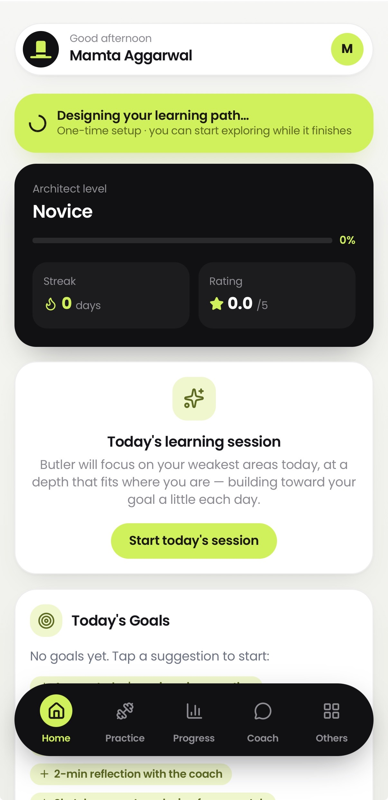
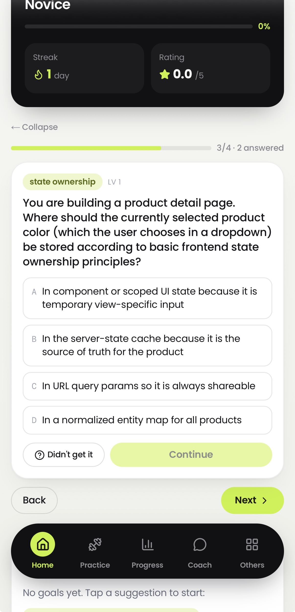
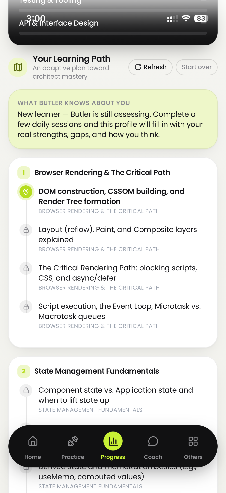
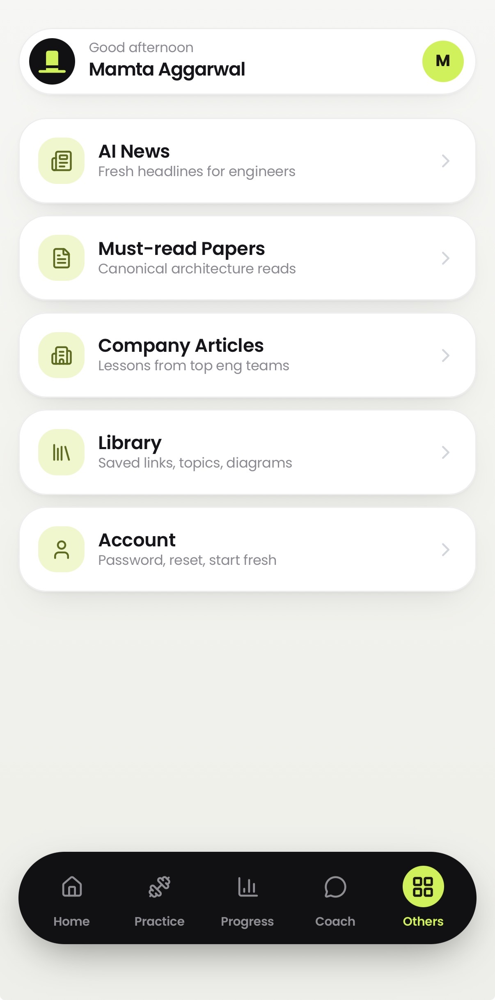
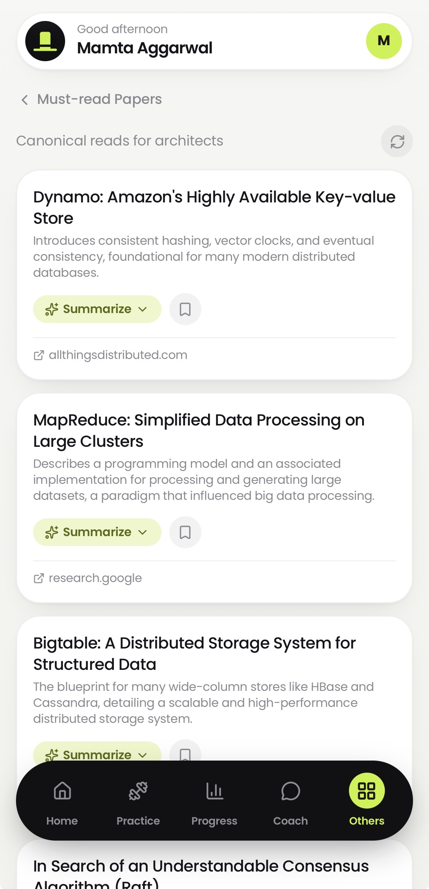

<div align="center">


# Butler

**Your personal AI mentor for becoming a software architect.**

A daily, adaptive learning companion that builds a real profile of how you think —
your strengths, your gaps, your level — and coaches you toward architect-level
mastery a little every day.

Next.js 15 · Supabase · OpenRouter · PWA · mobile-first

</div>

---

## What is Butler?

Most engineers get better by accident. Butler makes it deliberate.

Every day it hands you a short, **web-grounded** learning session built around the
tradeoffs and failure modes senior engineers actually get wrong — CAP and
partitions, sharding pitfalls, cache stampedes, idempotency myths, cascading
failure. You answer, you explain your reasoning, and an **LLM judge** reads your
*cumulative* record to decide — conservatively — when you've truly earned the next
level. It never jumps you ahead on one good day.

It's not a quiz app. It's a mentor that remembers.

---

## Screens

> Screenshots live in [`docs/screenshots/`](docs/screenshots/). Drop your own PNGs
> there (filenames listed in that folder's README) and they'll render below.

<table>
  <tr>
    <td width="33%"></td>
    <td width="33%"></td>
    <td width="33%"></td>
  </tr>
  <tr>
    <td align="center"><b>Home</b><br/>Level, streak, today's session, goals</td>
    <td align="center"><b>Session</b><br/>MCQ → written answer → deeper MCQs</td>
    <td align="center"><b>Progress</b><br/>Skill map across every architect competency</td>
  </tr>
  <tr>
    <td width="33%"></td>
    <td width="33%"></td>
    <td width="33%"></td>
  </tr>
  <tr>
    <td align="center"><b>Practice</b><br/>60-second speed-MCQ brain gym</td>
    <td align="center"><b>Others</b><br/>News · Papers · Articles · Library · Account</td>
    <td align="center"><b>Papers</b><br/>Curated must-reads, summarize-on-open</td>
  </tr>
</table>

---

## Features

### 🎯 Adaptive daily sessions
- ~8 questions a day spanning **all** architect competencies (weighted toward your
  weak areas, cycling the rest over the week), plus one brand-new concept.
- **Web-grounded** (`:online`): questions draw on real incidents, postmortems, and
  current best practices — not invented toy examples.
- Each question is **MCQ → typed explanation → 3 deeper follow-up MCQs** on the same
  concept, so recognition, reasoning, and robustness are all tested.
- **"Didn't get it?"** reframes a question at the same difficulty.

### 🧠 An LLM judge that actually judges you
- After each session, an LLM reads your **cumulative** per-skill history (levels,
  proficiency trend, prior verdicts) — never a single day — and returns
  `advance` / `hold` / `downgrade` per skill with a one-line *why*.
- **Confidence-gated:** a skill needs ~4 sessions at its level before it's even
  eligible to advance. It defaults to *hold*. It moves you up only on a sustained
  trend, and eases you back only if basics are clearly broken.
- Weighs three signals: the MCQ (recognition), your written answer (depth), and the
  follow-up MCQs (does your understanding hold up from other angles).

### 📚 Learn, don't just test
- **Learn this topic** — generates a focused study article on any concept.
- **Visualize** — renders a Mermaid diagram of the idea.
- **Must-read Papers** & **Company Articles** — LLM-curated with web search, with
  **summarize-on-open** (a detailed study guide for any paper/post, cached).
- **AI News** — a fresh daily digest for engineers.
- **Library** — everything you save (links, topics, diagrams) in one place.

### 🏋️ Practice (brain gym)
- 60-second timed speed-MCQ rounds across memory, logic, spatial, pattern, mental
  math, verbal, and attention. Score by speed + accuracy.

### 💬 Coach
- A chat mentor with memory — it rolls each day's conversation into a durable
  summary so it carries continuity even after raw messages are pruned.

### 👤 Multi-user & private by design
- Anyone can sign up and get their **own** private Butler.
- Every user has an **independent profile, progression, and LLM judge** — enforced
  by Postgres Row-Level Security (`auth.uid() = user_id`) at the database layer.
- Only reference content (news, paper summaries) is shared; all *learning* is
  isolated per user.

### 📱 PWA
- Installable, offline-tolerant app shell, mobile-first design.

---

## Tech stack

| Layer | Choice |
|-------|--------|
| Framework | **Next.js 15** (App Router, RSC, route handlers) |
| Language | TypeScript |
| Styling | Tailwind + a custom charcoal/lime design system |
| Auth + DB | **Supabase** (Postgres, Auth, Row-Level Security) |
| LLM | **OpenRouter** (model-agnostic; `:online` web search) |
| Diagrams | Mermaid (lazy-loaded) |
| Hosting | Vercel (+ daily cron) |

**Model-agnostic by role.** `lib/models.ts` maps four roles — `judge`, `generate`,
`web`, `coach` — to models via env vars, each falling back to `OPENROUTER_MODEL`,
then to a sensible default (`google/gemini-2.5-flash`). Swap any role's model in one
place without touching code.

---

## Getting started

### Prerequisites
- Node 20+
- A [Supabase](https://supabase.com) project
- An [OpenRouter](https://openrouter.ai) API key

### 1. Install
```bash
npm install
```

### 2. Configure environment
Create `.env.local` (never commit it — it's gitignored):

```bash
# Supabase
NEXT_PUBLIC_SUPABASE_URL=https://YOUR-PROJECT.supabase.co
NEXT_PUBLIC_SUPABASE_PUBLISHABLE_KEY=sb_publishable_...
SUPABASE_SERVICE_ROLE_KEY=eyJ...            # server-only; bypasses RLS

# OpenRouter
OPENROUTER_API_KEY=sk-or-v1-...
OPENROUTER_MODEL=google/gemini-2.5-flash    # default for all roles

# Optional: override a specific role's model
# OPENROUTER_MODEL_JUDGE=...
# OPENROUTER_MODEL_GENERATE=...
# OPENROUTER_MODEL_WEB=...
# OPENROUTER_MODEL_COACH=...

# Daily cron auth (any long random string)
CRON_SECRET=your-random-secret
```

### 3. Set up the database
In the Supabase SQL editor, run **`supabase/all_migrations.sql`** (the consolidated
schema), or apply `schema.sql` then the numbered migrations `003`–`013` in order.

### 4. Run
```bash
npm run dev        # http://localhost:3000
```
Sign up, and Butler seeds a baseline profile + curriculum on first run.

> **macOS note:** if the dev server can't reach Supabase/OpenRouter with a TLS
> `UNABLE_TO_GET_ISSUER_CERT_LOCALLY` error (common behind a corporate proxy), point
> Node at your system CA bundle:
> `NODE_EXTRA_CA_CERTS="$HOME/.your-ca.pem" npm run dev`.

---

## Deployment (Vercel)

1. Import the repo into Vercel.
2. Add all env vars above to **Project → Settings → Environment Variables**
   (`.env.local` is not deployed).
3. The daily cron is defined in `vercel.json` — it runs `/api/cron/daily` at
   **06:00 UTC** to build the day's news digest, brain-gym set, and each user's
   learning journal. (Hobby tier allows one cron/day and caps functions at 60s.)

---

## How progression works (the short version)

```
Daily session  ─►  you answer (MCQ + explanation + follow-ups)
                        │
                        ▼
                 LLM judge reads your CUMULATIVE trend
                        │
        ┌───────────────┼───────────────┐
     advance          hold           downgrade
   (eligible +      (default —      (basics clearly
    strong trend)   keep building)   broken)
                        │
                        ▼
        skill_profile + curriculum update (per user)
```

It is **not** reinforcement learning in the ML sense — no model is trained. The
adaptation lives in the data the LLM re-reads each session: your rolling per-skill
history, proficiency (an EMA), sessions-at-level, and the judge's prior verdicts.

---

## Project layout

```
app/
  api/
    session/        generate · answer · followup · reframe · process (the judge)
    plan/           adaptive curriculum generation
    papers/ articles/ news/ summarize/   web-grounded content + summaries
    brain-gym/      speed-round questions
    cron/daily/     daily content + per-user rollups
    ...
  login/            auth (password + magic link)
components/         Dashboard, Session, Profile, Coach, BrainGym, Library, Feed, ...
lib/
  models.ts         role → model mapping
  session-gen.ts    question generation + parsing
  openrouter.ts     thin OpenRouter client (streaming + :online)
  supabase/         server / client / admin clients
supabase/           schema.sql + numbered migrations + all_migrations.sql
```

---

<div align="center">
<sub>Built as a personal daily-growth companion. Charcoal + lime, mobile-first.</sub>
</div>
